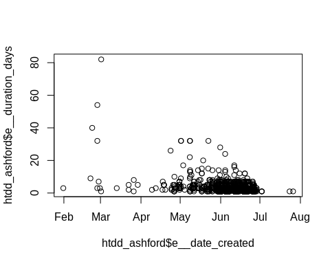

<!-- README.md is generated from README.Rmd. Please edit that file -->

# roadworksUK

The goal of roadworksUK is to enable you to access, process and visualis
data on UK roadworks, particularly Electronic Transfer of Notifications
(EToN)
records.

## Installation

<!-- You can install the released version of roadworksUK from [CRAN](https://CRAN.R-project.org) with: -->

Install the package hosted on [GitHub](https://github.com/) with:

``` r
# install.packages("devtools")
devtools::install_github("ITSLeeds/roadworksUK")
```

Load the package with:

``` r
library(roadworksUK)
```

## What’s in the package?

There are a number of functions for processing EToN records, as shown
by:

``` r
x <- library(help = roadworksUK)
x$info[[2]]
#>  [1] "highway_authorities     Highway authorities"                            
#>  [2] "htdd_ashford            EtON roadworks data (raw HTDD logs from Elgin)" 
#>  [3] "msoa_ashford            msoa boundary data for ashford"                 
#>  [4] "road_stats              Road statistics for HAs"                        
#>  [5] "rw_clean                clean roadworks data"                           
#>  [6] "rw_clean_points         Clean Spatial Part of the HDDT Data"            
#>  [7] "rw_import_elgin_batch   Bulk Import Elgin road works data"              
#>  [8] "rw_import_elgin_ed      Import Elgin ED road works data"                
#>  [9] "rw_import_elgin_htdd    Import Elgin HDDT road works data"              
#> [10] "rw_import_elgin_restrictions"                                           
#> [11] "                        Import Elgin Restrictions road works data"      
#> [12] "rw_import_elgin_ttvdd   Import Elgin TTVDD road works data"             
#> [13] "rw_import_scot          Import Scottish road works data"                
#> [14] "rw_points_to_region     Match Points to Regions"                        
#> [15] "rw_spatial              Convert an data frame containing roadworks data"
#> [16] "                        into a spatial data object"                     
#> [17] "rw_spec_scottish        Scottish road works spec"
```

The datasets provided by the package include `kent10`, a minimal dataset
containing data from Kent, `htdd_ashford`, ~981 records from Ashford,
Kent. The characteristics of these datasets is demonstrated below:

``` r
data("htdd_ashford")
dim(htdd_ashford) # a larger dataset
#> [1] 981  90
htdd_ashford[1:3, 1:5]
#>           id entity_id item_id                works_ref project_ref
#> 446 38017881 105824835 4187672          EB006-M16861611            
#> 447 38017882 105824859 4187693              GE605218822            
#> 525 38017960 105860399 4211964 GE4000ENT000000058915491
```

``` r
file_path = system.file("extdata", "kent10.csv.gz", package = "roadworksUK")
file.exists(file_path)
#> [1] TRUE
htdd_example = rw_import_elgin_htdd(file_path = file_path)
ncol(htdd_example)
#> [1] 91
nrow(htdd_example) # a small dataset with 10 rows
#> [1] 10
```

## A quick example: common roadworks in Ashford

A good way to ‘get the measure’ of potentially large spatio-temporal
datasets is to find their size (in MB/GB/TB and number of rows/columns)
and their temporal extent (we’ll plot its spatial extent soon). We can
find all of these things for the `htdd_ashford` dataset as follows:

``` r
pryr::object_size(htdd_ashford) # less than 2 MB - good test dataset
#> 1.65 MB
nrow(htdd_ashford)
#> [1] 981
ncol(htdd_ashford)
#> [1] 90
range(htdd_ashford$e__date_created)
#> [1] "2018-01-31 13:35:31 UTC" "2018-07-26 09:33:05 UTC"
```

The following commands can find-out who reports road works in Ashford,
using the **tidyverse** package:

``` r
library(tidyverse)
htdd_ashford %>% 
  group_by(publisher_name) %>% 
  summarise(n = n()) %>% 
  arrange(desc(n))
#> # A tibble: 2 x 2
#>   publisher_name          n
#>   <chr>               <int>
#> 1 Kent County Council   975
#> 2 Highways England        6
```

It’s mostly Kenty County Council. There are a handful of reports by HE
in the region also. Find out who does the work with the following
commands (this finds the top 5 organisations, change then `n` parameter
to see more organisations):

``` r
htdd_ashford %>% 
  group_by(responsible_org_name) %>% 
  summarise(n = n()) %>% 
  arrange(desc(n)) %>% 
  top_n(n = 5, wt = n)
#> # A tibble: 5 x 2
#>   responsible_org_name                n
#>   <chr>                           <int>
#> 1 KENT COUNTY COUNCIL               528
#> 2 South East Water                  273
#> 3 BT                                 47
#> 4 UK POWER NETWORKS SOUTH EASTERN    38
#> 5 SOUTHERN GAS NETWORKS              24
```

Let’s take a look at the temporal distribution of roadworks in the
example dataset:

``` r
plot(htdd_ashford$e__date_created, htdd_ashford$e__duration_days)
```


This distribution is characteristic of roadworks data: it’s not usually
logged when it begins but after it ends. A log of actual reporting dates
is illustrated in the next plot:

``` r
plot(htdd_ashford$e__date_updated, htdd_ashford$e__duration_days)
```


This shows the log comes from a single month (June) in 2018. We can do
more sophisticated plots building on these examples and using packages
such as **ggplot2**. For now, we will move on to plot the spatial extent
of the object:

``` r
library(tmap)
tmap_mode("view")
#> tmap mode set to interactive viewing
tm_basemap(server = leaflet::providers$OpenTopoMap) +
  qtm(htdd_ashford$i__location_point)
#> Linking to GEOS 3.6.2, GDAL 2.2.3, proj.4 4.9.3
```



``` r
library(tidyverse)
htdd_small = htdd_ashford %>% 
  select(description)
```
